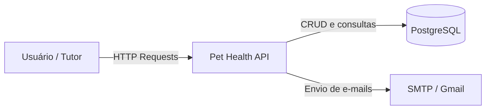
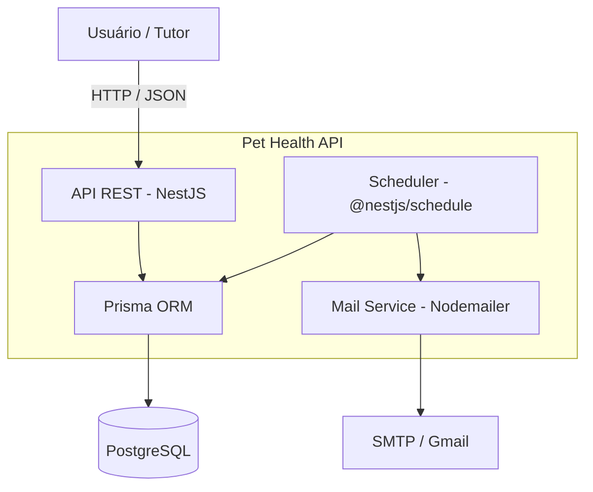
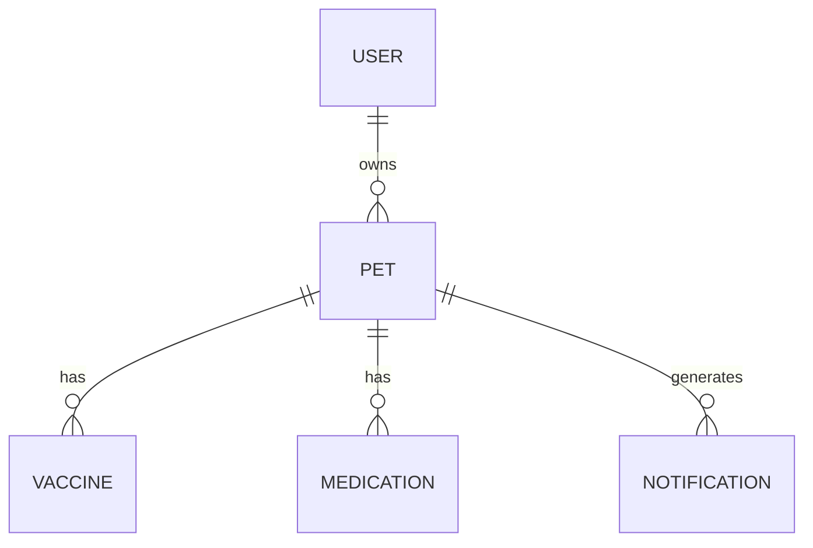
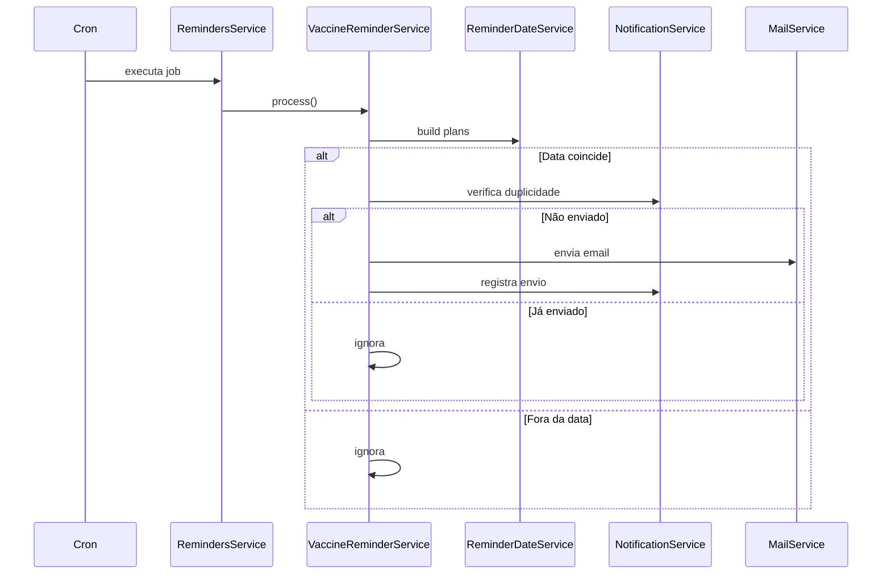
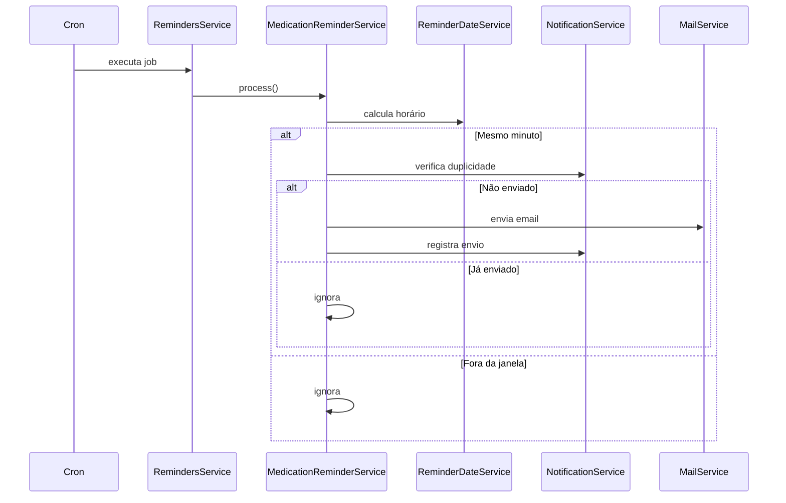
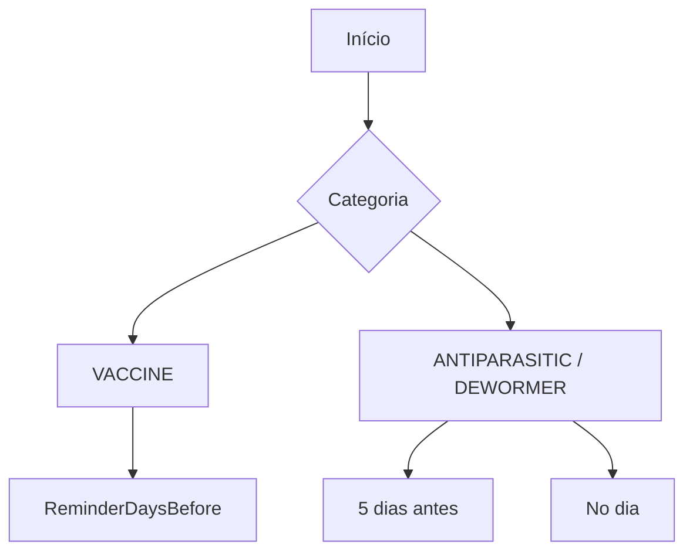
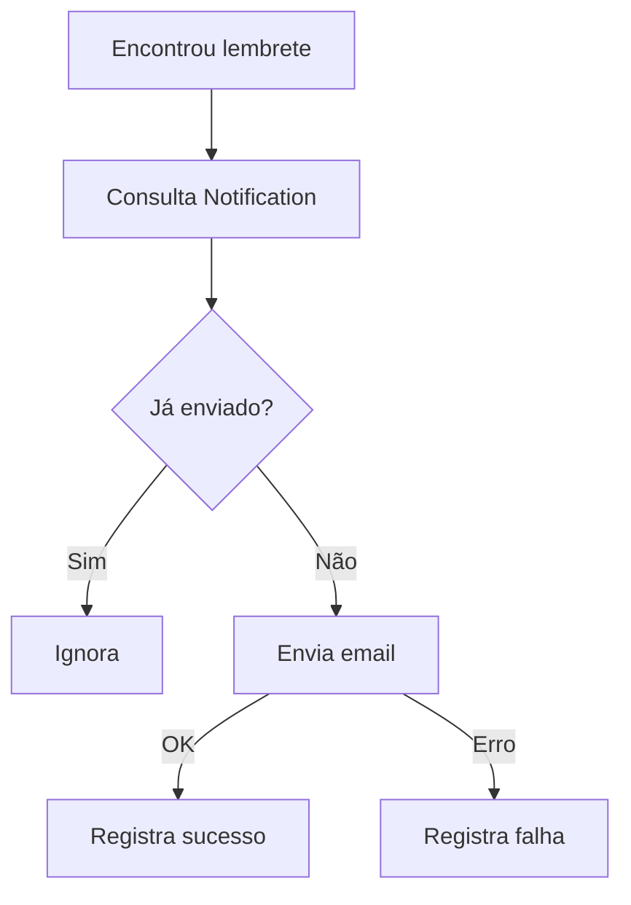

# Pet Health API - Diagramas

Este documento reúne os principais diagramas da aplicação **Pet Health API**, cobrindo visão de contexto, módulos internos, domínio, fluxos principais e regras de lembrete.

---

## 1. Diagrama de contexto

---

## 2. Diagrama de containers

---

## 3. Diagrama de componentes

```mermaid
flowchart TD
    AppModule[AppModule]

    UsersModule[UsersModule]
    PetsModule[PetsModule]
    VaccinesModule[VaccinesModule]
    MedicationsModule[MedicationsModule]
    MailModule[MailModule]
    RemindersModule[RemindersModule]
    PrismaModule[PrismaModule]

    PrismaService[PrismaService]
    MailService[MailService]
    RemindersService[RemindersService]

    VaccineReminderService[VaccineReminderService]
    MedicationReminderService[MedicationReminderService]
    ReminderDateService[ReminderDateService]
    NotificationService[NotificationService]

    AppModule --> UsersModule
    AppModule --> PetsModule
    AppModule --> VaccinesModule
    AppModule --> MedicationsModule
    AppModule --> MailModule
    AppModule --> RemindersModule
    AppModule --> PrismaModule

    PrismaModule --> PrismaService
    MailModule --> MailService
    RemindersModule --> RemindersService
    RemindersModule --> VaccineReminderService
    RemindersModule --> MedicationReminderService
    RemindersModule --> ReminderDateService
    RemindersModule --> NotificationService
```

---

## 4. Diagrama de domínio

---

## 5. Fluxo de lembrete de vacina

---

## 6. Fluxo de lembrete de medicamento

---

## 7. Regras de negócio

---

## 8. Prevenção de duplicidade

---

## 9. Observações

* Vacinas usam datas em UTC
* Medicamentos usam horário local
* Scheduler depende da aplicação rodando
* Sistema evita duplicidade de envio
* Estrutura baseada em separação de responsabilidades
