# Pet Health API - Diagramas

Este documento reúne os principais diagramas da aplicação **Pet Health API**, cobrindo visão de contexto, módulos internos, domínio, fluxos principais e regras de lembrete.

---

## 1. Diagrama de contexto

Visão de alto nível da interação entre usuário, sistema, banco e serviço de e-mail.

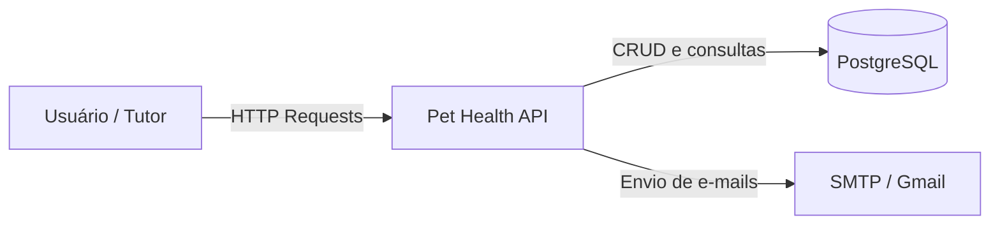

---

## 2. Diagrama de containers

Mostra os blocos principais da solução.

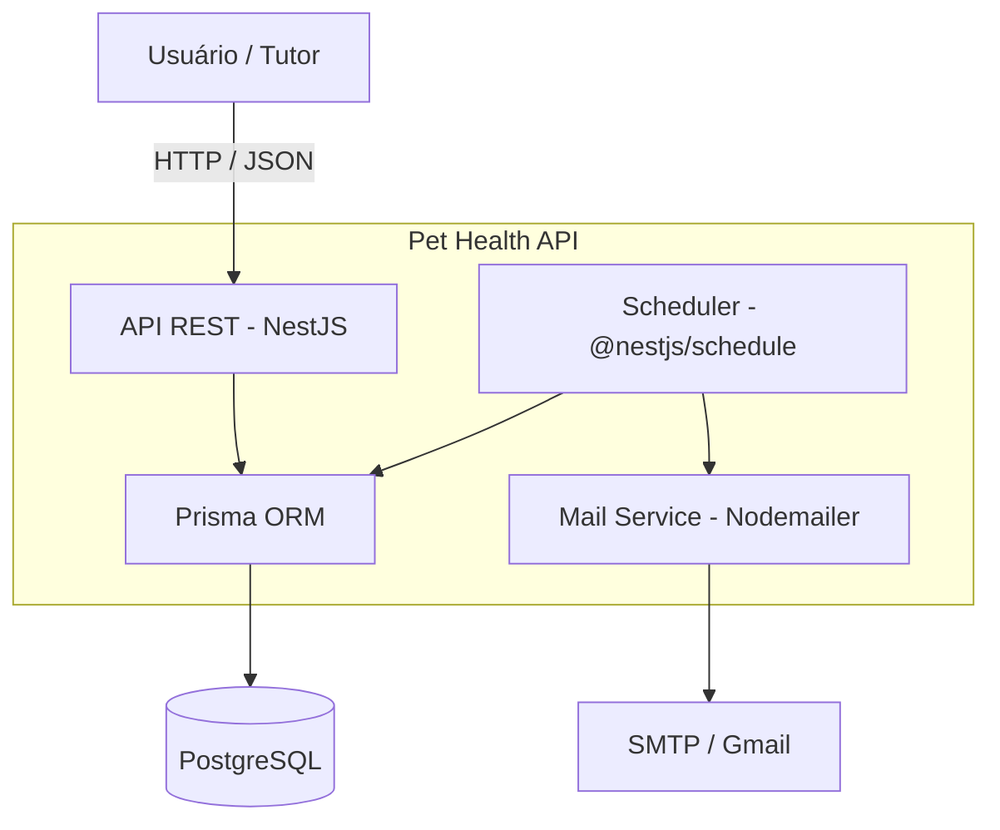

---

## 3. Diagrama de componentes

Mostra os módulos principais da aplicação e suas dependências.

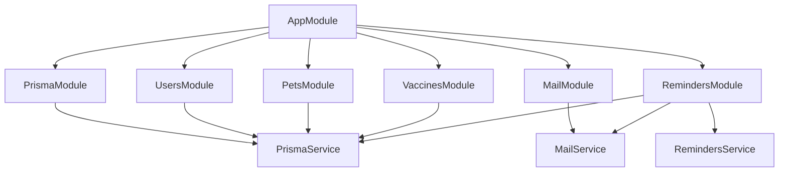

---

## 4. Estrutura resumida do projeto

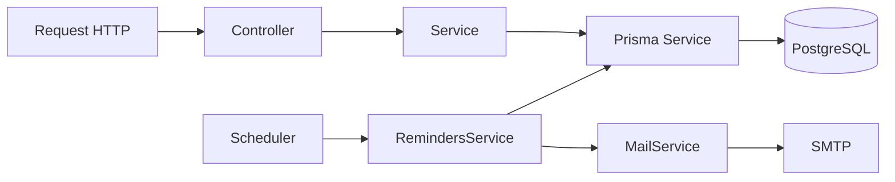

---

## 5. Diagrama de domínio

Mostra as entidades principais e seus relacionamentos.

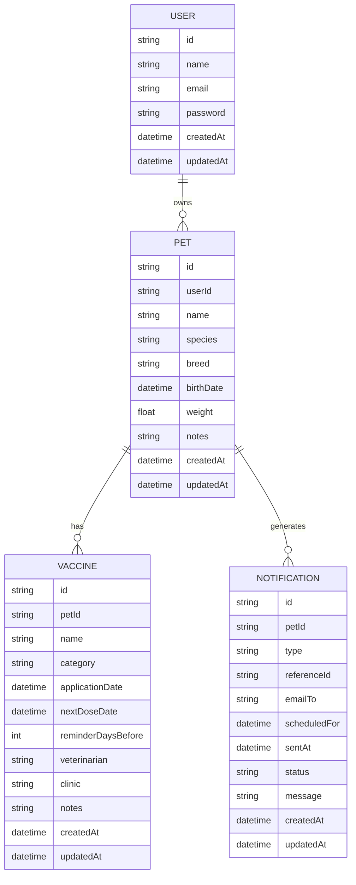

---

## 6. Fluxo de cadastro de usuário

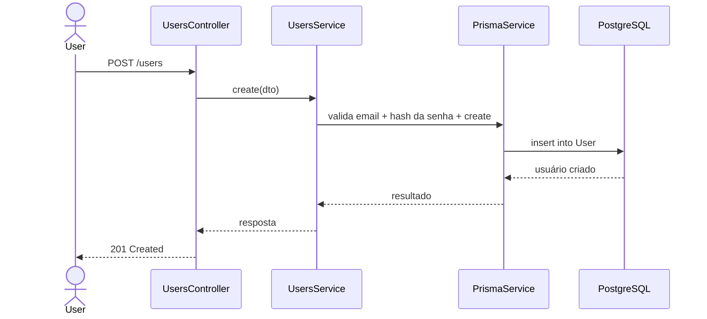

---

## 7. Fluxo de cadastro de pet

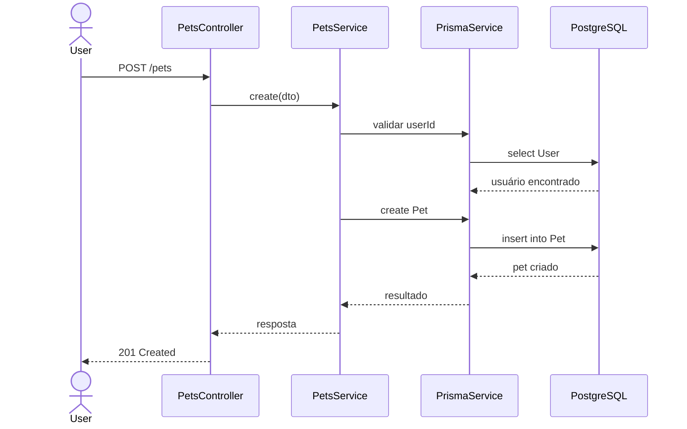

---

## 8. Fluxo de cadastro de vacina ou tratamento

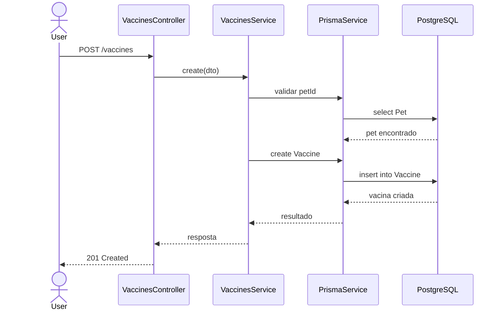

---

## 9. Fluxo geral do scheduler

Mostra o comportamento do cron.

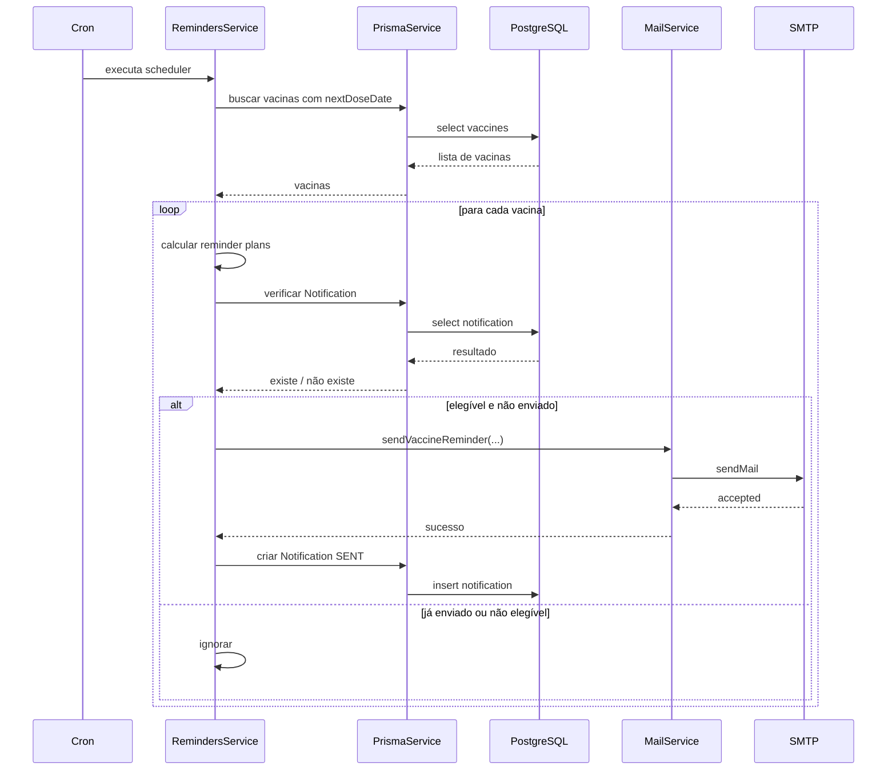

---

## 10. Regras de lembrete por categoria

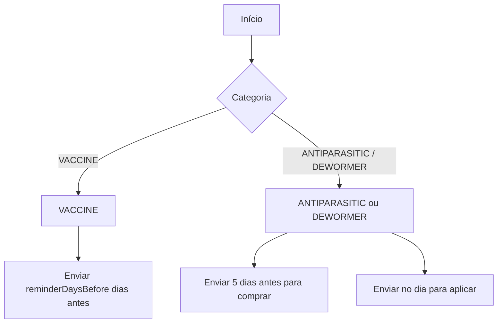

---

## 11. Fluxo de cálculo de lembretes

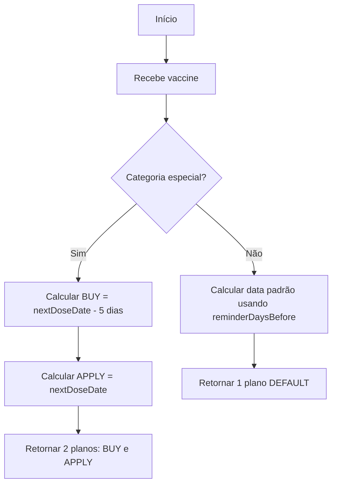

---

## 12. Fluxo de prevenção de duplicidade

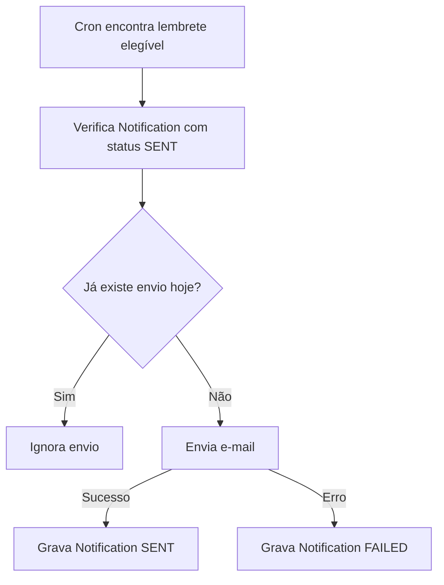

---

## 13. Fluxo de envio de e-mail

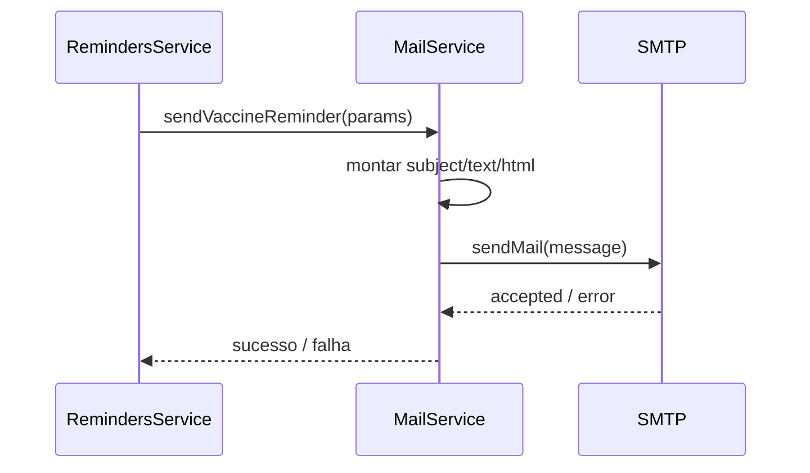

---

## 14. Fluxo específico para antipulgas e vermífugo

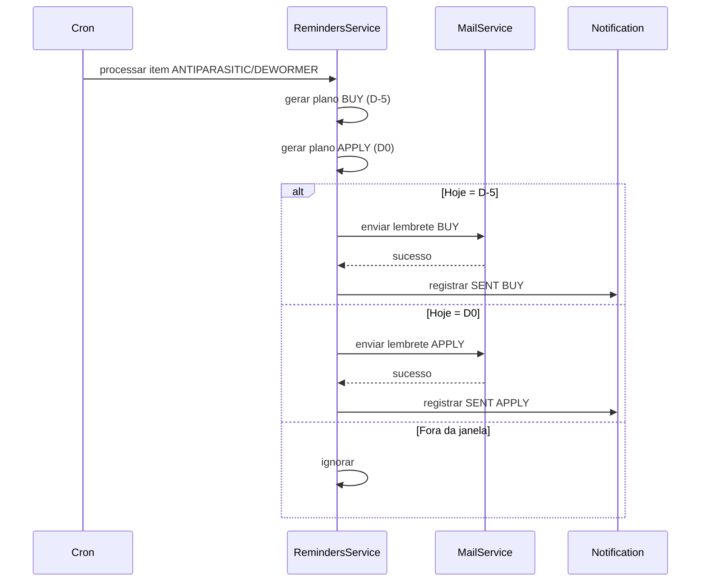

---

## 15. Fluxo específico para vacina comum

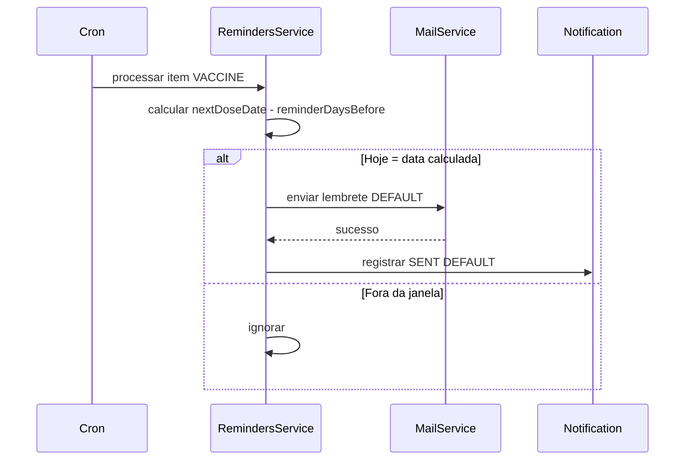

---

## 16. Diagrama de estados da notificação

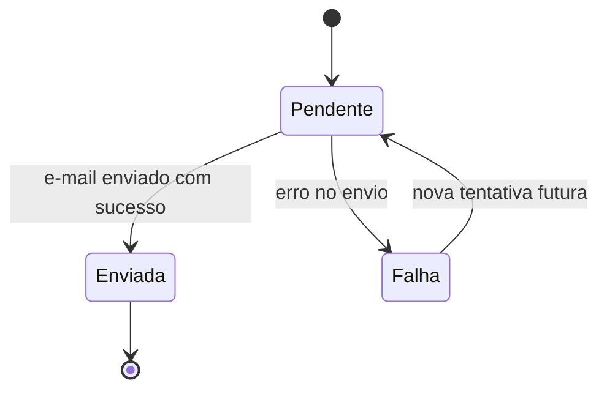

---

## 17. Pontos de evolução

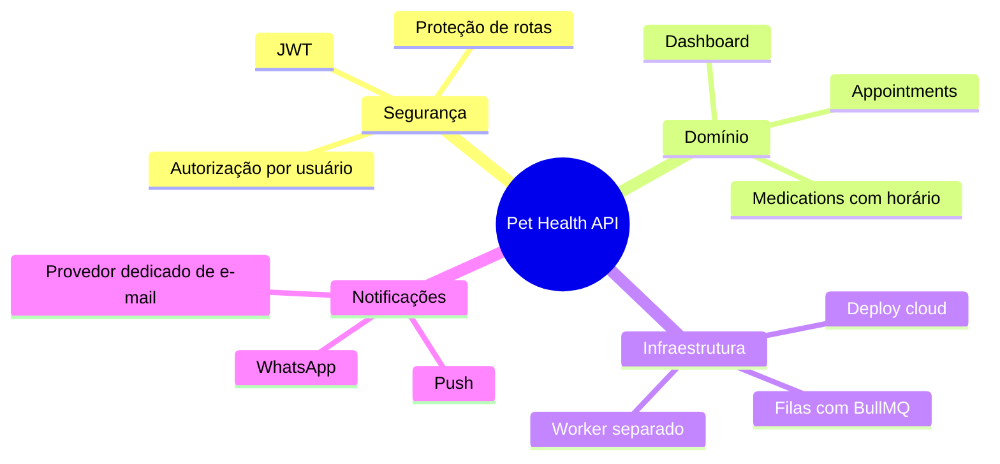

---

## 18. Observações

* Os diagramas refletem a arquitetura atual do projeto.
* As datas são tratadas em UTC para evitar inconsistências.
* O scheduler depende da aplicação estar em execução.
* A entidade `Vaccine` atualmente concentra vacinas e tratamentos preventivos.
